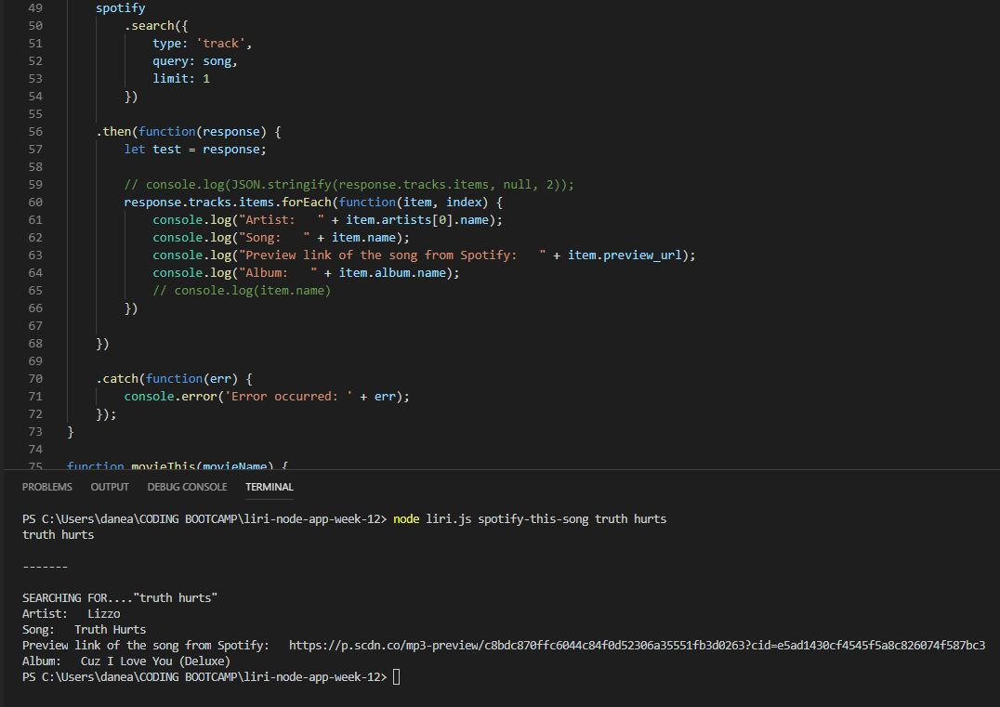

# liri-node-app-week-12

Basic code that include methods that are built into the Node.js:

Below are the functions included in this app:

Below is a switch statement for running the various commands:

Below is the code, command and results for running the "concert-this" command:

Below is the code, command and results for running the "spotify-this-song" command:

Below is the code, command and results for running the "movie-this" command:

Below is the code, command and results for running the "do-what-it-says" command:

